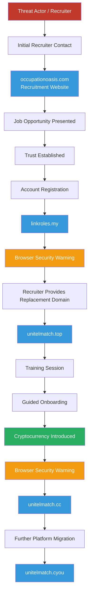
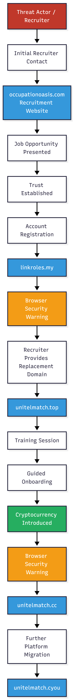

# Attack Graph

**Case ID:** OSINT-2026-001

**Investigation Title:** Cyber Threat Intelligence Investigation into a Multi-Domain Recruitment Fraud Campaign

**Classification:** Open Source Intelligence (OSINT) / Cyber Threat Intelligence (CTI)

**Status:** Investigation Complete

**Version:** 1.0

---

# Objective

This document models the observed attack flow as an evidence-based attack graph. It illustrates the relationships between the threat actor, campaign infrastructure, victim interactions, and operational workflow observed during the investigation.

Unlike the Investigation Timeline, which presents events chronologically, the attack graph focuses on how campaign components interact throughout the recruitment process.

Only behaviors directly observed during the investigation are represented.

---

# Scope

The attack graph includes:

- Threat actor interactions
- Recruitment infrastructure
- Operational domain migration
- Victim onboarding
- Browser security warnings
- Cryptocurrency-related observations

No malware delivery, persistence, privilege escalation, lateral movement, or command-and-control activity was observed and these phases are intentionally excluded.

---

# Attack Graph

> **Interactive version:** See the Mermaid diagram below





---

# Attack Flow Summary

The campaign followed a structured social engineering workflow:

1. Initial recruiter contact following a legitimate job application.
2. Presentation of a professional recruitment website.
3. Guided registration on operational onboarding portals.
4. Continuous recruiter guidance throughout onboarding.
5. Migration to replacement domains following browser security warnings.
6. Introduction of cryptocurrency-related activity after user trust had been established.

Each phase relied on voluntary user interaction rather than technical exploitation.

---

# Graph Components

| Component | Description |
|-----------|-------------|
| Threat Actor         Recruiter directing the onboarding process        |
| Recruitment Website | Initial legitimacy and branding                  |
| Operational Domains | User onboarding platforms                        |
| Browser Warnings    | Trigger for infrastructure migration             |
| Victim              | User performing guided actions                   |
| Cryptocurrency      | Financial component introduced during onboarding |

---

# Infrastructure Relationships

The investigation documented the following operational infrastructure sequence:

```
occupationoasis.com
        │
        ▼
linkroles.my
        │
        ▼
unitelmatch.top
        │
        ▼
unitelmatch.cc
        │
        ▼
unitelmatch.cyou
```

Each infrastructure transition preserved the same onboarding workflow while directing the participant to a replacement platform.

---

# ATT&CK Relationship

| ATT&CK Technique | Observed Activity |
|------------------|-------------------|
| T1583.001         | Acquisition and rotation of domains       |
| T1583.006         | Use of cloud-hosted web services          |
| T1566             | Recruiter-led social engineering          |
| T1656             | Presentation as a legitimate employer     |
| T1204             | User execution through guided interaction |
| T1078 (Potential) | Account creation on operational platforms |
| T1056 (Potential) | Voluntary credential entry                |

---

# Analytical Assessment

The attack graph demonstrates a campaign that relied primarily on social engineering supported by rapidly evolving web infrastructure.

Rather than attempting technical exploitation, the campaign gradually established trust through recruiter interaction, professional branding, and guided onboarding. Infrastructure rotation following browser security warnings enabled campaign continuity while maintaining the same operational workflow.

The graph highlights relationships between infrastructure, recruiter guidance, and victim interaction rather than depicting a traditional intrusion sequence.

---

# Key Observations

- The campaign relied on voluntary user interaction.
- Recruiter guidance remained consistent throughout the investigation.
- Multiple domains performed equivalent operational roles.
- Browser security warnings preceded infrastructure migration.
- Cryptocurrency-related activity was introduced only after trust had been established.
- No evidence of malware deployment, persistence, or command-and-control activity was observed.

---

# Evidence

| Evidence ID | Description |
|-------------|-------------|
| [CTI-2026-07_balance_insufficient_221_help_center](https://github.com/Hugh-Kumbi/Operation-Phantom-Store/blob/main/Evidence/Screenshots/CTI-2026-07_balance_insufficient_221_help_center.png) | Recruiter directs investigator via LINE to contact customer service regarding account funding. |
| [CTI-2026-07_blue_checkmark_language_exchange](https://github.com/Hugh-Kumbi/Operation-Phantom-Store/blob/main/Evidence/Screenshots/CTI-2026-07_blue_checkmark_language_exchange.png) | Investigator sends recruiter via LINE a screenshot of the conversation with customer service. |
| [CTI-2026-07_candidate_compliance_UI_highlight](https://github.com/Hugh-Kumbi/Operation-Phantom-Store/blob/main/Evidence/Screenshots/CTI-2026-07_candidate_compliance_UI_highlight.png) | Recruiter sends investigator via LINE a screenshot highlighting step 1 for clearing the open order. |
| [CTI-2026-07_customer_financial_trc20_address_highlighted](https://github.com/Hugh-Kumbi/Operation-Phantom-Store/blob/main/Evidence/Screenshots/CTI-2026-07_customer_financial_trc20_address_highlighted.png) | Screenshot of a conversation between investigator and customer service regarding a crypto transfer to pre-fund the online store. Customer service provides the TRC20 address `TMbunybGaMmrjt91SAJ8YGRDGkZ65huntH` for the funds and requests proof of payment. |
| [CTI-2026-07_customer_service_contact_button](https://github.com/Hugh-Kumbi/Operation-Phantom-Store/blob/main/Evidence/Screenshots/CTI-2026-07_customer_service_contact_button.png) | Recruiter sends investigator via LINE a screenshot showing how to contact customer service. |
| [CTI-2026-07_customer_service_replied_finalize](https://github.com/Hugh-Kumbi/Operation-Phantom-Store/blob/main/Evidence/Screenshots/CTI-2026-07_customer_service_replied_finalize.png) | Recruiter provides investigator via LINE with their own online store as a training ground and guides the investigator on how to communicate with customer service, requesting a screenshot of the investigator's conversation with customer service on the recruiter's account. |
| [CTI-2026-07_customer_service_traffic_task_request](https://github.com/Hugh-Kumbi/Operation-Phantom-Store/blob/main/Evidence/Screenshots/CTI-2026-07_customer_service_traffic_task_request.png) | Recruiter provides investigator via LINE with a script to request "extra traffic" from customer service. |
| [CTI-2026-07_customer_service_traffic_task_request_conversation](https://github.com/Hugh-Kumbi/Operation-Phantom-Store/blob/main/Evidence/Screenshots/CTI-2026-07_customer_service_traffic_task_request_conversation.png) | Screenshot of a conversation with customer service on the linkroles.my domain using the script provided by the recruiter. Shows the crypto address `TMbunybGaMmrjt91SAJ8YGRDGkZ65huntH` for the funds and a request for proof of payment. |
| [CTI-2026-07_financial_recruiter_trc20_address](https://github.com/Hugh-Kumbi/Operation-Phantom-Store/blob/main/Evidence/Screenshots/CTI-2026-07_financial_recruiter_trc20_address.png) | Customer service sends the TRC20 address for the deposit to pre-fund orders in the investigator's store. | 
| [CTI-2026-07_financial_trc20_address_request](https://github.com/Hugh-Kumbi/Operation-Phantom-Store/blob/main/Evidence/Screenshots/CTI-2026-07_financial_trc20_address_request.png) | Recruiter requests via LINE the crypto wallet address provided by customer service. |
| [CTI-2026-07_full_transcript_hugh_trc20](https://github.com/Hugh-Kumbi/Operation-Phantom-Store/blob/main/Evidence/Screenshots/CTI-2026-07_full_transcript_hugh_trc20.png) | Investigator provides recruiter via LINE with the TRC20 wallet address `TMbunybGaMmrjt91SAJ8YGRDGkZ65huntH` supplied by customer service, as requested. |
| [CTI-2026-07_full_transcript_transaction_summary](https://github.com/Hugh-Kumbi/Operation-Phantom-Store/blob/main/Evidence/Screenshots/CTI-2026-07_full_transcript_transaction_summary.png) | Recruiter explains via LINE that investigator will receive a 5–10% bonus for training on the recruiter's account, and instructs the investigator to contact customer service on that account to learn the process for their own account. |
| [CTI-2026-07_linkroles_customer_service_traffic_task_request](https://github.com/Hugh-Kumbi/Operation-Phantom-Store/blob/main/Evidence/Screenshots/CTI-2026-07_linkroles_customer_service_traffic_task_request.png) | Screenshot showing the message the investigator sent to customer service to request task traffic – `linkroles.my`. |
| [CTI-2026-07_recruiter_address_request](https://github.com/Hugh-Kumbi/Operation-Phantom-Store/blob/main/Evidence/Screenshots/CTI-2026-07_recruiter_address_request.png) | Recruiter requests via LINE the wallet address `TMbunybGaMmrjt91SAJ8YGRDGkZ65huntH` provided by customer service while the investigator was training on the recruiter's account. |
| [CTI-2026-07_recruiter_traffic_task_apply_instruction](https://github.com/Hugh-Kumbi/Operation-Phantom-Store/blob/main/Evidence/Screenshots/CTI-2026-07_recruiter_traffic_task_apply_instruction.png) | Recruiter sends investigator via LINE a script to request "extra traffic" from customer service, and the investigator sends a screenshot of the customer service communication console. |
| [CTI-2026-07_training_recharge_instruction](https://github.com/Hugh-Kumbi/Operation-Phantom-Store/blob/main/Evidence/Screenshots/CTI-2026-07_training_recharge_instruction.png) | Recruiter instructs investigator via LINE on how to recharge the recruiter's account to process the open order, pointing to contacting customer service. |
| [EV-001-01](https://github.com/Hugh-Kumbi/Operation-Phantom-Store/blob/main/Evidence/Screenshots/EV-001-01.png), [EV-001-02](https://github.com/Hugh-Kumbi/Operation-Phantom-Store/blob/main/Evidence/Screenshots/EV-001-02.png), [EV-001-03](https://github.com/Hugh-Kumbi/Operation-Phantom-Store/blob/main/Evidence/Screenshots/EV-001-03.png), [EV-001-04](https://github.com/Hugh-Kumbi/Operation-Phantom-Store/blob/main/Evidence/Screenshots/EV-001-04.png) | Occupation Oasis job listing |
| [EV-002-01](https://github.com/Hugh-Kumbi/Operation-Phantom-Store/blob/main/Evidence/Screenshots/EV-002-01.png) | Initial recruiter contact |
| [EV-002-01](https://github.com/Hugh-Kumbi/Operation-Phantom-Store/blob/main/Evidence/Screenshots/EV-002-01.png), [EV-002-02](https://github.com/Hugh-Kumbi/Operation-Phantom-Store/blob/main/Evidence/Screenshots/EV-002-02.png), [EV-002-03](https://github.com/Hugh-Kumbi/Operation-Phantom-Store/blob/main/Evidence/Screenshots/EV-002-03.png), [EV-002-04](https://github.com/Hugh-Kumbi/Operation-Phantom-Store/blob/main/Evidence/Screenshots/EV-002-04.png), [EV-002-05](https://github.com/Hugh-Kumbi/Operation-Phantom-Store/blob/main/Evidence/Screenshots/EV-002-05.png), [EV-002-06](https://github.com/Hugh-Kumbi/Operation-Phantom-Store/blob/main/Evidence/Screenshots/EV-002-06.png), [EV-002-07](https://github.com/Hugh-Kumbi/Operation-Phantom-Store/blob/main/Evidence/Screenshots/EV-002-07.png), [EV-002-08](https://github.com/Hugh-Kumbi/Operation-Phantom-Store/blob/main/Evidence/Screenshots/EV-002-08.png), [EV-002-09](https://github.com/Hugh-Kumbi/Operation-Phantom-Store/blob/main/Evidence/Screenshots/EV-002-09.png), [EV-002-10](https://github.com/Hugh-Kumbi/Operation-Phantom-Store/blob/main/Evidence/Screenshots/EV-002-10.png), [EV-002-11](https://github.com/Hugh-Kumbi/Operation-Phantom-Store/blob/main/Evidence/Screenshots/EV-002-11.png), [EV-002-12](https://github.com/Hugh-Kumbi/Operation-Phantom-Store/blob/main/Evidence/Screenshots/EV-002-12.png), [EV-002-13](https://github.com/Hugh-Kumbi/Operation-Phantom-Store/blob/main/Evidence/Screenshots/EV-002-13.png), [EV-002-14](https://github.com/Hugh-Kumbi/Operation-Phantom-Store/blob/main/Evidence/Screenshots/EV-002-14.png), [EV-002-15](https://github.com/Hugh-Kumbi/Operation-Phantom-Store/blob/main/Evidence/Screenshots/EV-002-15.png), [EV-002-16](https://github.com/Hugh-Kumbi/Operation-Phantom-Store/blob/main/Evidence/Screenshots/EV-002-16.png), [EV-002-17](https://github.com/Hugh-Kumbi/Operation-Phantom-Store/blob/main/Evidence/Screenshots/EV-002-17.png), [EV-002-18](https://github.com/Hugh-Kumbi/Operation-Phantom-Store/blob/main/Evidence/Screenshots/EV-002-18.png), [EV-002-19](https://github.com/Hugh-Kumbi/Operation-Phantom-Store/blob/main/Evidence/Screenshots/EV-002-19.png), [EV-002-20](https://github.com/Hugh-Kumbi/Operation-Phantom-Store/blob/main/Evidence/Screenshots/EV-002-20.png), [EV-002-21](https://github.com/Hugh-Kumbi/Operation-Phantom-Store/blob/main/Evidence/Screenshots/EV-002-21.png), [EV-002-22](https://github.com/Hugh-Kumbi/Operation-Phantom-Store/blob/main/Evidence/Screenshots/EV-002-22.png), [EV-002-23](https://github.com/Hugh-Kumbi/Operation-Phantom-Store/blob/main/Evidence/Screenshots/EV-002-23.png), [EV-002-24](https://github.com/Hugh-Kumbi/Operation-Phantom-Store/blob/main/Evidence/Screenshots/EV-002-24.png), [EV-002-25](https://github.com/Hugh-Kumbi/Operation-Phantom-Store/blob/main/Evidence/Screenshots/EV-002-25.png), [EV-002-26](https://github.com/Hugh-Kumbi/Operation-Phantom-Store/blob/main/Evidence/Screenshots/EV-002-26.png), [EV-002-27](https://github.com/Hugh-Kumbi/Operation-Phantom-Store/blob/main/Evidence/Screenshots/EV-002-27.png), [EV-002-28](https://github.com/Hugh-Kumbi/Operation-Phantom-Store/blob/main/Evidence/Screenshots/EV-002-28.png), [EV-002-29](https://github.com/Hugh-Kumbi/Operation-Phantom-Store/blob/main/Evidence/Screenshots/EV-002-29.png), [EV-002-30](https://github.com/Hugh-Kumbi/Operation-Phantom-Store/blob/main/Evidence/Screenshots/EV-002-30.png), [EV-002-31](https://github.com/Hugh-Kumbi/Operation-Phantom-Store/blob/main/Evidence/Screenshots/EV-002-31.png), [EV-002-32](https://github.com/Hugh-Kumbi/Operation-Phantom-Store/blob/main/Evidence/Screenshots/EV-002-32.png), [EV-002-33](https://github.com/Hugh-Kumbi/Operation-Phantom-Store/blob/main/Evidence/Screenshots/EV-002-33.png), [EV-002-34](https://github.com/Hugh-Kumbi/Operation-Phantom-Store/blob/main/Evidence/Screenshots/EV-002-34.png), [EV-002-35](https://github.com/Hugh-Kumbi/Operation-Phantom-Store/blob/main/Evidence/Screenshots/EV-002-35.png), [EV-002-36](https://github.com/Hugh-Kumbi/Operation-Phantom-Store/blob/main/Evidence/Screenshots/EV-002-36.png), [EV-002-37](https://github.com/Hugh-Kumbi/Operation-Phantom-Store/blob/main/Evidence/Screenshots/EV-002-37.png), [EV-002-38](https://github.com/Hugh-Kumbi/Operation-Phantom-Store/blob/main/Evidence/Screenshots/EV-002-38.png), [EV-002-39](https://github.com/Hugh-Kumbi/Operation-Phantom-Store/blob/main/Evidence/Screenshots/EV-002-39.png), [EV-002-40](https://github.com/Hugh-Kumbi/Operation-Phantom-Store/blob/main/Evidence/Screenshots/EV-002-40.png), [EV-002-41](https://github.com/Hugh-Kumbi/Operation-Phantom-Store/blob/main/Evidence/Screenshots/EV-002-41.png), [EV-002-42](https://github.com/Hugh-Kumbi/Operation-Phantom-Store/blob/main/Evidence/Screenshots/EV-002-42.png), [EV-002-43](https://github.com/Hugh-Kumbi/Operation-Phantom-Store/blob/main/Evidence/Screenshots/EV-002-43.png), [EV-002-44](https://github.com/Hugh-Kumbi/Operation-Phantom-Store/blob/main/Evidence/Screenshots/EV-002-44.png), [EV-002-45](https://github.com/Hugh-Kumbi/Operation-Phantom-Store/blob/main/Evidence/Screenshots/EV-002-45.png), [EV-002-46](https://github.com/Hugh-Kumbi/Operation-Phantom-Store/blob/main/Evidence/Screenshots/EV-002-46.png), [EV-002-47](https://github.com/Hugh-Kumbi/Operation-Phantom-Store/blob/main/Evidence/Screenshots/EV-002-47.png), [EV-002-48](https://github.com/Hugh-Kumbi/Operation-Phantom-Store/blob/main/Evidence/Screenshots/EV-002-48.png), [EV-002-49](https://github.com/Hugh-Kumbi/Operation-Phantom-Store/blob/main/Evidence/Screenshots/EV-002-49.png), [EV-002-50](https://github.com/Hugh-Kumbi/Operation-Phantom-Store/blob/main/Evidence/Screenshots/EV-002-50.png), [EV-002-51](https://github.com/Hugh-Kumbi/Operation-Phantom-Store/blob/main/Evidence/Screenshots/EV-002-51.png), [EV-002-52](https://github.com/Hugh-Kumbi/Operation-Phantom-Store/blob/main/Evidence/Screenshots/EV-002-52.png), [EV-002-53](https://github.com/Hugh-Kumbi/Operation-Phantom-Store/blob/main/Evidence/Screenshots/EV-002-53.png), [EV-002-54](https://github.com/Hugh-Kumbi/Operation-Phantom-Store/blob/main/Evidence/Screenshots/EV-002-54.png), [EV-002-55](https://github.com/Hugh-Kumbi/Operation-Phantom-Store/blob/main/Evidence/Screenshots/EV-002-55.png), [EV-002-56](https://github.com/Hugh-Kumbi/Operation-Phantom-Store/blob/main/Evidence/Screenshots/EV-002-56.png), [EV-002-57](https://github.com/Hugh-Kumbi/Operation-Phantom-Store/blob/main/Evidence/Screenshots/EV-002-57.png), [EV-002-58](https://github.com/Hugh-Kumbi/Operation-Phantom-Store/blob/main/Evidence/Screenshots/EV-002-58.png), [EV-002-59](https://github.com/Hugh-Kumbi/Operation-Phantom-Store/blob/main/Evidence/Screenshots/EV-002-59.png), [EV-002-60](https://github.com/Hugh-Kumbi/Operation-Phantom-Store/blob/main/Evidence/Screenshots/EV-002-60.png), [EV-002-61](https://github.com/Hugh-Kumbi/Operation-Phantom-Store/blob/main/Evidence/Screenshots/EV-002-61.png), [EV-002-62](https://github.com/Hugh-Kumbi/Operation-Phantom-Store/blob/main/Evidence/Screenshots/EV-002-62.png), [EV-002-63](https://github.com/Hugh-Kumbi/Operation-Phantom-Store/blob/main/Evidence/Screenshots/EV-002-63.png), [EV-002-64](https://github.com/Hugh-Kumbi/Operation-Phantom-Store/blob/main/Evidence/Screenshots/EV-002-64.png), [EV-002-65](https://github.com/Hugh-Kumbi/Operation-Phantom-Store/blob/main/Evidence/Screenshots/EV-002-65.png), [EV-002-66](https://github.com/Hugh-Kumbi/Operation-Phantom-Store/blob/main/Evidence/Screenshots/EV-002-66.png), [EV-002-67](https://github.com/Hugh-Kumbi/Operation-Phantom-Store/blob/main/Evidence/Screenshots/EV-002-67.png), [EV-002-68](https://github.com/Hugh-Kumbi/Operation-Phantom-Store/blob/main/Evidence/Screenshots/EV-002-68.png), [EV-002-69](https://github.com/Hugh-Kumbi/Operation-Phantom-Store/blob/main/Evidence/Screenshots/EV-002-69.png), [EV-002-70](https://github.com/Hugh-Kumbi/Operation-Phantom-Store/blob/main/Evidence/Screenshots/EV-002-70.png), [EV-002-71](https://github.com/Hugh-Kumbi/Operation-Phantom-Store/blob/main/Evidence/Screenshots/EV-002-71.png), [EV-002-72](https://github.com/Hugh-Kumbi/Operation-Phantom-Store/blob/main/Evidence/Screenshots/EV-002-72.png), [EV-002-73](https://github.com/Hugh-Kumbi/Operation-Phantom-Store/blob/main/Evidence/Screenshots/EV-002-73.png), [EV-002-74](https://github.com/Hugh-Kumbi/Operation-Phantom-Store/blob/main/Evidence/Screenshots/EV-002-74.png), [EV-002-75](https://github.com/Hugh-Kumbi/Operation-Phantom-Store/blob/main/Evidence/Screenshots/EV-002-75.png), [EV-002-76](https://github.com/Hugh-Kumbi/Operation-Phantom-Store/blob/main/Evidence/Screenshots/EV-002-76.png), [EV-002-77](https://github.com/Hugh-Kumbi/Operation-Phantom-Store/blob/main/Evidence/Screenshots/EV-002-77.png), [EV-002-78](https://github.com/Hugh-Kumbi/Operation-Phantom-Store/blob/main/Evidence/Screenshots/EV-002-78.png), [EV-002-79](https://github.com/Hugh-Kumbi/Operation-Phantom-Store/blob/main/Evidence/Screenshots/EV-002-79.png), [EV-002-80](https://github.com/Hugh-Kumbi/Operation-Phantom-Store/blob/main/Evidence/Screenshots/EV-002-80.png), [EV-002-81](https://github.com/Hugh-Kumbi/Operation-Phantom-Store/blob/main/Evidence/Screenshots/EV-002-81.png), [EV-002-82](https://github.com/Hugh-Kumbi/Operation-Phantom-Store/blob/main/Evidence/Screenshots/EV-002-82.png), [EV-002-83](https://github.com/Hugh-Kumbi/Operation-Phantom-Store/blob/main/Evidence/Screenshots/EV-002-83.png), [EV-002-84](https://github.com/Hugh-Kumbi/Operation-Phantom-Store/blob/main/Evidence/Screenshots/EV-002-84.png), [EV-002-85](https://github.com/Hugh-Kumbi/Operation-Phantom-Store/blob/main/Evidence/Screenshots/EV-002-85.png), [EV-002-86](https://github.com/Hugh-Kumbi/Operation-Phantom-Store/blob/main/Evidence/Screenshots/EV-002-86.png) | Onboarding instructions |
| [EV-005-01](https://github.com/Hugh-Kumbi/Operation-Phantom-Store/blob/main/Evidence/Screenshots/EV-005-01.png), [EV-005-02](https://github.com/Hugh-Kumbi/Operation-Phantom-Store/blob/main/Evidence/Screenshots/EV-005-02.png), [EV-005-03](https://github.com/Hugh-Kumbi/Operation-Phantom-Store/blob/main/Evidence/Screenshots/EV-005-03.png), [EV-005-04](https://github.com/Hugh-Kumbi/Operation-Phantom-Store/blob/main/Evidence/Screenshots/EV-005-03.png), [EV-005-05](https://github.com/Hugh-Kumbi/Operation-Phantom-Store/blob/main/Evidence/Screenshots/EV-005-05.png), [EV-005-06](https://github.com/Hugh-Kumbi/Operation-Phantom-Store/blob/main/Evidence/Screenshots/EV-005-06.png), [EV-005-07](https://github.com/Hugh-Kumbi/Operation-Phantom-Store/blob/main/Evidence/Screenshots/EV-005-07.png) | Registration instructions |
| [EV-006-01](https://github.com/Hugh-Kumbi/Operation-Phantom-Store/blob/main/Evidence/Screenshots/EV-006-01.png), [EV-006-02](https://github.com/Hugh-Kumbi/Operation-Phantom-Store/blob/main/Evidence/Screenshots/EV-006-02.png), [EV-006-03](https://github.com/Hugh-Kumbi/Operation-Phantom-Store/blob/main/Evidence/Screenshots/EV-006-03.png), [EV-006-04](https://github.com/Hugh-Kumbi/Operation-Phantom-Store/blob/main/Evidence/Screenshots/EV-006-04.png), [EV-006-05](https://github.com/Hugh-Kumbi/Operation-Phantom-Store/blob/main/Evidence/Screenshots/EV-006-05.png) | Registration page – `linkroles.my` |
| [EV-012-01](https://github.com/Hugh-Kumbi/Operation-Phantom-Store/blob/main/Evidence/Screenshots/EV-012-01.png) | Google Safe Browsing warning – `linkroles.my` |
| [EV-012-02](https://github.com/Hugh-Kumbi/Operation-Phantom-Store/blob/main/Evidence/Screenshots/EV-012-02.png) | Google Safe Browsing warning – `unitelmatch.top` |
| [EV-012-03](https://github.com/Hugh-Kumbi/Operation-Phantom-Store/blob/main/Evidence/Screenshots/EV-012-03.png) | Google Safe Browsing warning – `unitelmatch.cc` |
| [EV-012-04](https://github.com/Hugh-Kumbi/Operation-Phantom-Store/blob/main/Evidence/Screenshots/EV-012-04.png) | Google Safe Browsing warning – `unitelmatch.cyou` |
| [EV-013-01](https://github.com/Hugh-Kumbi/Operation-Phantom-Store/blob/main/Evidence/Screenshots/EV-013-01.png) | Domain migration – `unitelmatch.top` |
| [EV-013-02](https://github.com/Hugh-Kumbi/Operation-Phantom-Store/blob/main/Evidence/Screenshots/EV-013-02.png) | Domain migration – `unitelmatch.cc` |
| [EV-013-03](https://github.com/Hugh-Kumbi/Operation-Phantom-Store/blob/main/Evidence/Screenshots/EV-013-03.png) | Domain migration – `unitelmatch.cyou` |
| [EV-016-01](https://github.com/Hugh-Kumbi/Operation-Phantom-Store/blob/main/Evidence/Screenshots/EV-016-01.png), [EV-016-02](https://github.com/Hugh-Kumbi/Operation-Phantom-Store/blob/main/Evidence/Screenshots/EV-016-02.png), [EV-016-03](https://github.com/Hugh-Kumbi/Operation-Phantom-Store/blob/main/Evidence/Screenshots/EV-016-03.png), [EV-016-04](https://github.com/Hugh-Kumbi/Operation-Phantom-Store/blob/main/Evidence/Screenshots/EV-016-04.png), [EV-016-05](https://github.com/Hugh-Kumbi/Operation-Phantom-Store/blob/main/Evidence/Screenshots/EV-016-05.png), [EV-016-06](https://github.com/Hugh-Kumbi/Operation-Phantom-Store/blob/main/Evidence/Screenshots/EV-016-06.png), [EV-016-07](https://github.com/Hugh-Kumbi/Operation-Phantom-Store/blob/main/Evidence/Screenshots/EV-016-07.png) | Domain Analysis – `occupationoasis.com`  |
| [EV-017-01](https://github.com/Hugh-Kumbi/Operation-Phantom-Store/blob/main/Evidence/Screenshots/EV-017-01.png), [EV-017-02](https://github.com/Hugh-Kumbi/Operation-Phantom-Store/blob/main/Evidence/Screenshots/EV-017-02.png), [EV-017-03](https://github.com/Hugh-Kumbi/Operation-Phantom-Store/blob/main/Evidence/Screenshots/EV-017-03.png), [EV-017-04](https://github.com/Hugh-Kumbi/Operation-Phantom-Store/blob/main/Evidence/Screenshots/EV-017-04.png) | Domain Analysis – `linkroles.my` |
| [EV-018-01](https://github.com/Hugh-Kumbi/Operation-Phantom-Store/blob/main/Evidence/Screenshots/EV-018-01.png), [EV-018-02](https://github.com/Hugh-Kumbi/Operation-Phantom-Store/blob/main/Evidence/Screenshots/EV-018-02.png), [EV-018-03](https://github.com/Hugh-Kumbi/Operation-Phantom-Store/blob/main/Evidence/Screenshots/EV-018-03.png), [EV-018-04](https://github.com/Hugh-Kumbi/Operation-Phantom-Store/blob/main/Evidence/Screenshots/EV-018-04.png) | Domain Analysis – `unitelmatch.top` |
| [EV-018-05](https://github.com/Hugh-Kumbi/Operation-Phantom-Store/blob/main/Evidence/Screenshots/EV-018-05.png), [EV-018-06](https://github.com/Hugh-Kumbi/Operation-Phantom-Store/blob/main/Evidence/Screenshots/EV-018-06.png), [EV-018-07](https://github.com/Hugh-Kumbi/Operation-Phantom-Store/blob/main/Evidence/Screenshots/EV-018-07.png), [EV-018-08](https://github.com/Hugh-Kumbi/Operation-Phantom-Store/blob/main/Evidence/Screenshots/EV-018-08.png), [EV-018-09](https://github.com/Hugh-Kumbi/Operation-Phantom-Store/blob/main/Evidence/Screenshots/EV-018-09.png), [EV-018-10](https://github.com/Hugh-Kumbi/Operation-Phantom-Store/blob/main/Evidence/Screenshots/EV-018-10.png) | Domain Analysis – `unitelmatch.cc` |
| [EV-018-11](https://github.com/Hugh-Kumbi/Operation-Phantom-Store/blob/main/Evidence/Screenshots/EV-018-11.png), [EV-018-12](https://github.com/Hugh-Kumbi/Operation-Phantom-Store/blob/main/Evidence/Screenshots/EV-018-12.png), [EV-018-13](https://github.com/Hugh-Kumbi/Operation-Phantom-Store/blob/main/Evidence/Screenshots/EV-018-13.png), [EV-018-14](https://github.com/Hugh-Kumbi/Operation-Phantom-Store/blob/main/Evidence/Screenshots/EV-018-14.png), [EV-018-15](https://github.com/Hugh-Kumbi/Operation-Phantom-Store/blob/main/Evidence/Screenshots/EV-018-15.png), [EV-018-16](https://github.com/Hugh-Kumbi/Operation-Phantom-Store/blob/main/Evidence/Screenshots/EV-018-16.png) | Domain Analysis – `unitelmatch.cyou` |
| [EV-018-17](https://github.com/Hugh-Kumbi/Operation-Phantom-Store/blob/main/Evidence/Screenshots/EV-018-17.png), [EV-018-18](https://github.com/Hugh-Kumbi/Operation-Phantom-Store/blob/main/Evidence/Screenshots/EV-018-18.png), [EV-018-19](https://github.com/Hugh-Kumbi/Operation-Phantom-Store/blob/main/Evidence/Screenshots/EV-018-19.png), [EV-018-20](https://github.com/Hugh-Kumbi/Operation-Phantom-Store/blob/main/Evidence/Screenshots/EV-018-20.png), [EV-018-21](https://github.com/Hugh-Kumbi/Operation-Phantom-Store/blob/main/Evidence/Screenshots/EV-018-21.png), [EV-018-22](https://github.com/Hugh-Kumbi/Operation-Phantom-Store/blob/main/Evidence/Screenshots/EV-018-22.png) | Domain Analysis – `ioutrankap.cyou` |
| [EV-019-01](https://github.com/Hugh-Kumbi/Operation-Phantom-Store/blob/main/Evidence/Screenshots/EV-019-01.png) | Certificate  Transparency Logs – `occupationoasis.com` |
| [EV-020-01](https://github.com/Hugh-Kumbi/Operation-Phantom-Store/blob/main/Evidence/Screenshots/EV-020-01.png) | Certificate  Transparency Logs – `linkroles.my` |
| [EV-021-01](https://github.com/Hugh-Kumbi/Operation-Phantom-Store/blob/main/Evidence/Screenshots/EV-021-01.png)  | Certificate Transparency Logs – `unitelmatch.top` |
| [EV-021-02](https://github.com/Hugh-Kumbi/Operation-Phantom-Store/blob/main/Evidence/Screenshots/EV-021-02.png)  | Certificate Transparency Logs – `unitelmatch.cc` |
| [EV-021-03](https://github.com/Hugh-Kumbi/Operation-Phantom-Store/blob/main/Evidence/Screenshots/EV-021-03.png), [EV-021-04](https://github.com/Hugh-Kumbi/Operation-Phantom-Store/blob/main/Evidence/Screenshots/EV-021-04.png), [EV-021-05](https://github.com/Hugh-Kumbi/Operation-Phantom-Store/blob/main/Evidence/Screenshots/EV-021-05.png) | Certificate Transparency Logs – `unitelmatch.cyou` |
| [EV-033-23](https://github.com/Hugh-Kumbi/Operation-Phantom-Store/blob/main/Evidence/Screenshots/EV-033-23.png) | Certificate  Transparency Logs – `ioutrankap.cyou` |
| [EV-022-01](https://github.com/Hugh-Kumbi/Operation-Phantom-Store/blob/main/Evidence/Screenshots/EV-022-01.png), [EV-022-02](https://github.com/Hugh-Kumbi/Operation-Phantom-Store/blob/main/Evidence/Screenshots/EV-022-02.png), [EV-022-03](https://github.com/Hugh-Kumbi/Operation-Phantom-Store/blob/main/Evidence/Screenshots/EV-022-03.png), [EV-022-04](https://github.com/Hugh-Kumbi/Operation-Phantom-Store/blob/main/Evidence/Screenshots/EV-022-04.png) | WHOIS Records – `occupationoasis.com` |
| [EV-023-01](https://github.com/Hugh-Kumbi/Operation-Phantom-Store/blob/main/Evidence/Screenshots/EV-023-01.png), [EV-023-02](https://github.com/Hugh-Kumbi/Operation-Phantom-Store/blob/main/Evidence/Screenshots/EV-023-02.png) | WHOIS Records – `linkroles.my` |
| [EV-024-01](https://github.com/Hugh-Kumbi/Operation-Phantom-Store/blob/main/Evidence/Screenshots/EV-024-01.png), [EV-024-02](https://github.com/Hugh-Kumbi/Operation-Phantom-Store/blob/main/Evidence/Screenshots/EV-024-02.png), [EV-024-03](https://github.com/Hugh-Kumbi/Operation-Phantom-Store/blob/main/Evidence/Screenshots/EV-024-03.png) | WHOIS Records – `unitelmatch.top` |
| [EV-025-01](https://github.com/Hugh-Kumbi/Operation-Phantom-Store/blob/main/Evidence/Screenshots/EV-025-01.png), [EV-025-02](https://github.com/Hugh-Kumbi/Operation-Phantom-Store/blob/main/Evidence/Screenshots/EV-025-02.png), [EV-025-03](https://github.com/Hugh-Kumbi/Operation-Phantom-Store/blob/main/Evidence/Screenshots/EV-025-03.png), [EV-025-04](https://github.com/Hugh-Kumbi/Operation-Phantom-Store/blob/main/Evidence/Screenshots/EV-025-04.png), [EV-025-05](https://github.com/Hugh-Kumbi/Operation-Phantom-Store/blob/main/Evidence/Screenshots/EV-025-05.png), [EV-025-06](https://github.com/Hugh-Kumbi/Operation-Phantom-Store/blob/main/Evidence/Screenshots/EV-025-06.png) | WHOIS Records – `unitelmatch.cc` |
| [EV-025-07](https://github.com/Hugh-Kumbi/Operation-Phantom-Store/blob/main/Evidence/Screenshots/EV-025-07.png) [EV-025-08](https://github.com/Hugh-Kumbi/Operation-Phantom-Store/blob/main/Evidence/Screenshots/EV-025-08.png) [EV-025-09](https://github.com/Hugh-Kumbi/Operation-Phantom-Store/blob/main/Evidence/Screenshots/EV-025-09.png) | WHOIS Records – `unitelmatch.cyou` |
| [EV-025-10](https://github.com/Hugh-Kumbi/Operation-Phantom-Store/blob/main/Evidence/Screenshots/EV-025-10.png), [EV-025-11](https://github.com/Hugh-Kumbi/Operation-Phantom-Store/blob/main/Evidence/Screenshots/EV-025-11.png), [EV-025-12](https://github.com/Hugh-Kumbi/Operation-Phantom-Store/blob/main/Evidence/Screenshots/EV-025-12.png) | WHOIS Records – `ioutrankap.cyou` |
| [EV-026-01](https://github.com/Hugh-Kumbi/Operation-Phantom-Store/blob/main/Evidence/Screenshots/EV-026-01.png), [EV-026-02](https://github.com/Hugh-Kumbi/Operation-Phantom-Store/blob/main/Evidence/Screenshots/EV-026-02.png), [EV-026-03](https://github.com/Hugh-Kumbi/Operation-Phantom-Store/blob/main/Evidence/Screenshots/EV-026-03.png), [EV-026-04](https://github.com/Hugh-Kumbi/Operation-Phantom-Store/blob/main/Evidence/Screenshots/EV-026-04.png) | Reverse DNS Results – `occupationoasis.com` |
| [EV-026-05](https://github.com/Hugh-Kumbi/Operation-Phantom-Store/blob/main/Evidence/Screenshots/EV-026-05.png), [EV-026-06](https://github.com/Hugh-Kumbi/Operation-Phantom-Store/blob/main/Evidence/Screenshots/EV-026-06.png), [EV-026-07](https://github.com/Hugh-Kumbi/Operation-Phantom-Store/blob/main/Evidence/Screenshots/EV-026-07.png), [EV-026-08](https://github.com/Hugh-Kumbi/Operation-Phantom-Store/blob/main/Evidence/Screenshots/EV-026-08.png) | Reverse DNS Results – `linkroles.my` |
| [EV-026-09](https://github.com/Hugh-Kumbi/Operation-Phantom-Store/blob/main/Evidence/Screenshots/EV-026-09.png), [EV-026-10](https://github.com/Hugh-Kumbi/Operation-Phantom-Store/blob/main/Evidence/Screenshots/EV-026-10.png), [EV-026-11](https://github.com/Hugh-Kumbi/Operation-Phantom-Store/blob/main/Evidence/Screenshots/EV-026-11.png), [EV-026-12](https://github.com/Hugh-Kumbi/Operation-Phantom-Store/blob/main/Evidence/Screenshots/EV-026-12.png) | Reverse DNS Results – `unitelmatch.top` |
| [EV-026-13](https://github.com/Hugh-Kumbi/Operation-Phantom-Store/blob/main/Evidence/Screenshots/EV-026-13.png), [EV-026-14](https://github.com/Hugh-Kumbi/Operation-Phantom-Store/blob/main/Evidence/Screenshots/EV-026-14.png), [EV-026-15](https://github.com/Hugh-Kumbi/Operation-Phantom-Store/blob/main/Evidence/Screenshots/EV-026-15.png), [EV-026-16](https://github.com/Hugh-Kumbi/Operation-Phantom-Store/blob/main/Evidence/Screenshots/EV-026-16.png) | Reverse DNS Results – `unitelmatch.cc`  |
| [EV-026-17](https://github.com/Hugh-Kumbi/Operation-Phantom-Store/blob/main/Evidence/Screenshots/EV-026-17.png), [EV-026-18](https://github.com/Hugh-Kumbi/Operation-Phantom-Store/blob/main/Evidence/Screenshots/EV-026-18.png), [EV-026-19](https://github.com/Hugh-Kumbi/Operation-Phantom-Store/blob/main/Evidence/Screenshots/EV-026-19.png), [EV-026-20](https://github.com/Hugh-Kumbi/Operation-Phantom-Store/blob/main/Evidence/Screenshots/EV-026-20.png) | Reverse DNS Results – `unitelmatch.cyou` |
| [EV-026-21](http://github.com/Hugh-Kumbi/Operation-Phantom-Store/blob/main/Evidence/Screenshots/EV-026-21.png), [EV-026-22](https://github.com/Hugh-Kumbi/Operation-Phantom-Store/blob/main/Evidence/Screenshots/EV-026-22.png), [EV-026-23](https://github.com/Hugh-Kumbi/Operation-Phantom-Store/blob/main/Evidence/Screenshots/EV-026-23.png), [EV-026-24](https://github.com/Hugh-Kumbi/Operation-Phantom-Store/blob/main/Evidence/Screenshots/EV-026-24.png) | Reverse DNS Results – `ioutrankap.cyou` |
| [EV-032-01](https://github.com/Hugh-Kumbi/Operation-Phantom-Store/blob/main/Evidence/Screenshots/EV-032-01.png), [EV-032-02](https://github.com/Hugh-Kumbi/Operation-Phantom-Store/blob/main/Evidence/Screenshots/EV-032-02.png), [EV-032-03](https://github.com/Hugh-Kumbi/Operation-Phantom-Store/blob/main/Evidence/Screenshots/EV-032-03.png), [EV-032-04](https://github.com/Hugh-Kumbi/Operation-Phantom-Store/blob/main/Evidence/Screenshots/EV-032-04.png), [EV-032-05](https://github.com/Hugh-Kumbi/Operation-Phantom-Store/blob/main/Evidence/Screenshots/EV-032-05.png) | DNS Analysis – `occupationoasis.com` |
| [EV-032-06](https://github.com/Hugh-Kumbi/Operation-Phantom-Store/blob/main/Evidence/Screenshots/EV-032-06.png), [EV-032-07](https://github.com/Hugh-Kumbi/Operation-Phantom-Store/blob/main/Evidence/Screenshots/EV-032-07.png), [EV-032-08](https://github.com/Hugh-Kumbi/Operation-Phantom-Store/blob/main/Evidence/Screenshots/EV-032-08.png), [EV-032-09](https://github.com/Hugh-Kumbi/Operation-Phantom-Store/blob/main/Evidence/Screenshots/EV-032-09.png) | DNS Analysis – `linkroles.my` |
| [EV-032-10](https://github.com/Hugh-Kumbi/Operation-Phantom-Store/blob/main/Evidence/Screenshots/EV-032-10.png), [EV-032-11](https://github.com/Hugh-Kumbi/Operation-Phantom-Store/blob/main/Evidence/Screenshots/EV-032-11.png), [EV-032-12](https://github.com/Hugh-Kumbi/Operation-Phantom-Store/blob/main/Evidence/Screenshots/EV-032-12.png) | DNS Analysis – `unitelmatch.top` |
| [EV-032-13](https://github.com/Hugh-Kumbi/Operation-Phantom-Store/blob/main/Evidence/Screenshots/EV-032-13.png), [EV-032-14](https://github.com/Hugh-Kumbi/Operation-Phantom-Store/blob/main/Evidence/Screenshots/EV-032-14.png), [EV-032-15](https://github.com/Hugh-Kumbi/Operation-Phantom-Store/blob/main/Evidence/Screenshots/EV-032-15.png) | DNS Analysis – `unitelmatch.cc` |
| [EV-032-16](https://github.com/Hugh-Kumbi/Operation-Phantom-Store/blob/main/Evidence/Screenshots/EV-032-16.png) [EV-032-17](https://github.com/Hugh-Kumbi/Operation-Phantom-Store/blob/main/Evidence/Screenshots/EV-032-17.png) [EV-032-18](https://github.com/Hugh-Kumbi/Operation-Phantom-Store/blob/main/Evidence/Screenshots/EV-032-18.png), [EV-032-19](https://github.com/Hugh-Kumbi/Operation-Phantom-Store/blob/main/Evidence/Screenshots/EV-032-19.png) | DNS Analysis – `unitelmatch.cyou` |
| [EV-032-20](https://github.com/Hugh-Kumbi/Operation-Phantom-Store/blob/main/Evidence/Screenshots/EV-032-20.png), [EV-032-21](https://github.com/Hugh-Kumbi/Operation-Phantom-Store/blob/main/Evidence/Screenshots/EV-032-21.png), [EV-032-22](https://github.com/Hugh-Kumbi/Operation-Phantom-Store/blob/main/Evidence/Screenshots/EV-032-22.png) | DNS Analysis – `ioutrankap.cyou` |
| [EV-034-01](https://github.com/Hugh-Kumbi/Operation-Phantom-Store/blob/main/Evidence/Screenshots/EV-034-01.png), [EV-034-02](https://github.com/Hugh-Kumbi/Operation-Phantom-Store/blob/main/Evidence/Screenshots/EV-034-02.png), [EV-034-03](https://github.com/Hugh-Kumbi/Operation-Phantom-Store/blob/main/Evidence/Screenshots/EV-034-03.png)  | VirusTotal Relation Results – `occupationoasis.com` | 
| [EV-034-04](https://github.com/Hugh-Kumbi/Operation-Phantom-Store/blob/main/Evidence/Screenshots/EV-034-04.png), [EV-034-05](https://github.com/Hugh-Kumbi/Operation-Phantom-Store/blob/main/Evidence/Screenshots/EV-034-05.png)  | VirusTotal Relation Results – `linkroles.my` |
| [EV-034-06](https://github.com/Hugh-Kumbi/Operation-Phantom-Store/blob/main/Evidence/Screenshots/EV-034-06.png), [EV-034-07](https://github.com/Hugh-Kumbi/Operation-Phantom-Store/blob/main/Evidence/Screenshots/EV-034-07.png)  | VirusTotal Relation Results – `unitelmatch.top` |
| [EV-034-08](https://github.com/Hugh-Kumbi/Operation-Phantom-Store/blob/main/Evidence/Screenshots/EV-034-08.png), [EV-034-09](https://github.com/Hugh-Kumbi/Operation-Phantom-Store/blob/main/Evidence/Screenshots/EV-034-09.png)  | VirusTotal Relation Results – `unitelmatch.cc` |
| [EV-034-10](https://github.com/Hugh-Kumbi/Operation-Phantom-Store/blob/main/Evidence/Screenshots/EV-034-10.png), [EV-034-11](https://github.com/Hugh-Kumbi/Operation-Phantom-Store/blob/main/Evidence/Screenshots/EV-034-11.png)  | VirusTotal Relation Results – `unitelmatch.cyou` |
| [EV-034-12](https://github.com/Hugh-Kumbi/Operation-Phantom-Store/blob/main/Evidence/Screenshots/EV-034-12.png), [EV-034-13](https://github.com/Hugh-Kumbi/Operation-Phantom-Store/blob/main/Evidence/Screenshots/EV-034-13.png), [EV-034-14](https://github.com/Hugh-Kumbi/Operation-Phantom-Store/blob/main/Evidence/Screenshots/EV-034-14.png), [EV-034-15](https://github.com/Hugh-Kumbi/Operation-Phantom-Store/blob/main/Evidence/Screenshots/EV-034-15.png), [EV-034-16](https://github.com/Hugh-Kumbi/Operation-Phantom-Store/blob/main/Evidence/Screenshots/EV-034-16.png) | VirusTotal Relation Results – `ioutrankap.cyou` |
| [EV-035-01](https://github.com/Hugh-Kumbi/Operation-Phantom-Store/blob/main/Evidence/Screenshots/EV-035-01.png), [EV-035-02](https://github.com/Hugh-Kumbi/Operation-Phantom-Store/blob/main/Evidence/Screenshots/EV-035-02.png), [EV-035-03](https://github.com/Hugh-Kumbi/Operation-Phantom-Store/blob/main/Evidence/Screenshots/EV-035-03.png), [EV-035-04](https://github.com/Hugh-Kumbi/Operation-Phantom-Store/blob/main/Evidence/Screenshots/EV-035-04.png), [EV-035-05](https://github.com/Hugh-Kumbi/Operation-Phantom-Store/blob/main/Evidence/Screenshots/EV-035-05.png) | OKX Wallet observations |
| [EV-036-01](https://github.com/Hugh-Kumbi/Operation-Phantom-Store/blob/main/Evidence/Screenshots/EV-036-01.png), [EV-036-02](https://github.com/Hugh-Kumbi/Operation-Phantom-Store/blob/main/Evidence/Screenshots/EV-036-02.png), [EV-036-03](https://github.com/Hugh-Kumbi/Operation-Phantom-Store/blob/main/Evidence/Screenshots/EV-036-03.png) | OKX Wallet observations and Cryptocurrency screenshots |
| [EV-038-01](https://github.com/Hugh-Kumbi/Operation-Phantom-Store/blob/main/Evidence/Screenshots/EV-038-01.png) | Recruiter instructions directing migration to `unitelmatch.top` |
| [EV-045-01](https://github.com/Hugh-Kumbi/Operation-Phantom-Store/blob/main/Evidence/Screenshots/EV-045-01.png) | Recruiter providing `unitelmatch.cc` |
| [EV-049-01](https://github.com/Hugh-Kumbi/Operation-Phantom-Store/blob/main/Evidence/Screenshots/EV-049-01.png) | Recruiter providing `unitelmatch.cyou` |
| [EV-054-01](https://github.com/Hugh-Kumbi/Operation-Phantom-Store/blob/main/Evidence/Screenshots/EV-054-01.png), [EV-054-02](https://github.com/Hugh-Kumbi/Operation-Phantom-Store/blob/main/Evidence/Screenshots/EV-054-02.png), [EV-054-03](https://github.com/Hugh-Kumbi/Operation-Phantom-Store/blob/main/Evidence/Screenshots/EV-054-03.png), [EV-054-04](https://github.com/Hugh-Kumbi/Operation-Phantom-Store/blob/main/Evidence/Screenshots/EV-054-04.png), [EV-054-04](https://github.com/Hugh-Kumbi/Operation-Phantom-Store/blob/main/Evidence/Screenshots/EV-054-05.png) | AWS Route53 records – `occupationoasis.com` |
| [EV-055-01](https://github.com/Hugh-Kumbi/Operation-Phantom-Store/blob/main/Evidence/Screenshots/EV-055-01.png) | Browser Developer Tools – `occupationoasis.com` | 
| [EV-056-01](https://github.com/Hugh-Kumbi/Operation-Phantom-Store/blob/main/Evidence/Screenshots/EV-056-01.png) | Browser Developer Tools – `unitelmatch.top` |
| [EV-057-01](https://github.com/Hugh-Kumbi/Operation-Phantom-Store/blob/main/Evidence/Screenshots/EV-057-01.png) | Browser Developer Tools – `unitelmatch.cyou` |
| [EV-058-01](https://github.com/Hugh-Kumbi/Operation-Phantom-Store/blob/main/Evidence/Screenshots/EV-058-01.png) | Request headers – `unitelmatch.cyou` showing `merchant-id: 42` |
| [EV-059-01](https://github.com/Hugh-Kumbi/Operation-Phantom-Store/blob/main/Evidence/Screenshots/EV-059-01.png), [EV-059-02](https://github.com/Hugh-Kumbi/Operation-Phantom-Store/blob/main/Evidence/Screenshots/EV-059-02.png), [EV-059-03](https://github.com/Hugh-Kumbi/Operation-Phantom-Store/blob/main/Evidence/Screenshots/EV-059-03.png), [EV-059-04](https://github.com/Hugh-Kumbi/Operation-Phantom-Store/blob/main/Evidence/Screenshots/EV-059-04.png) | Request headers – `unitelmatch.top` |
| [EV-060-01](https://github.com/Hugh-Kumbi/Operation-Phantom-Store/blob/main/Evidence/Screenshots/EV-060-01.png), [EV-060-02](https://github.com/Hugh-Kumbi/Operation-Phantom-Store/blob/main/Evidence/Screenshots/EV-060-02.png), [EV-060-03](https://github.com/Hugh-Kumbi/Operation-Phantom-Store/blob/main/Evidence/Screenshots/EV-060-03.png), [EV-060-04](https://github.com/Hugh-Kumbi/Operation-Phantom-Store/blob/main/Evidence/Screenshots/EV-060-04.png), [EV-060-05](https://github.com/Hugh-Kumbi/Operation-Phantom-Store/blob/main/Evidence/Screenshots/EV-060-05.png) | API requests to `ioutrankap.cyou` |
| [EV-066-01](https://github.com/Hugh-Kumbi/Operation-Phantom-Store/blob/main/Evidence/Screenshots/EV-066-01.png), [EV-066-02](https://github.com/Hugh-Kumbi/Operation-Phantom-Store/blob/main/Evidence/Screenshots/EV-066-02.png), [EV-066-03](https://github.com/Hugh-Kumbi/Operation-Phantom-Store/blob/main/Evidence/Screenshots/EV-066-03.png), [EV-066-04](https://github.com/Hugh-Kumbi/Operation-Phantom-Store/blob/main/Evidence/Screenshots/EV-066-04.png) | VirusTotal Detection results & history – `occupationoasis.com` |
| [EV-067-01](https://github.com/Hugh-Kumbi/Operation-Phantom-Store/blob/main/Evidence/Screenshots/EV-067-01.png), [EV-067-02](https://github.com/Hugh-Kumbi/Operation-Phantom-Store/blob/main/Evidence/Screenshots/EV-067-02.png), [EV-067-03](https://github.com/Hugh-Kumbi/Operation-Phantom-Store/blob/main/Evidence/Screenshots/EV-067-03.png), [EV-067-04](https://github.com/Hugh-Kumbi/Operation-Phantom-Store/blob/main/Evidence/Screenshots/EV-067-04.png) | VirusTotal Detection results & history – `linkroles` |
| [EV-068-01](https://github.com/Hugh-Kumbi/Operation-Phantom-Store/blob/main/Evidence/Screenshots/EV-068-01.png), [EV-068-02](https://github.com/Hugh-Kumbi/Operation-Phantom-Store/blob/main/Evidence/Screenshots/EV-068-02.png), [EV-068-03](https://github.com/Hugh-Kumbi/Operation-Phantom-Store/blob/main/Evidence/Screenshots/EV-068-03.png), [EV-068-04](https://github.com/Hugh-Kumbi/Operation-Phantom-Store/blob/main/Evidence/Screenshots/EV-068-04.png) | VirusTotal Detection results & history – `unitelmatch.top` |
| [EV-069-01](https://github.com/Hugh-Kumbi/Operation-Phantom-Store/blob/main/Evidence/Screenshots/EV-069-01.png), [EV-069-02](https://github.com/Hugh-Kumbi/Operation-Phantom-Store/blob/main/Evidence/Screenshots/EV-069-02.png), [EV-069-03](https://github.com/Hugh-Kumbi/Operation-Phantom-Store/blob/main/Evidence/Screenshots/EV-069-03.png), [EV-069-04](https://github.com/Hugh-Kumbi/Operation-Phantom-Store/blob/main/Evidence/Screenshots/EV-069-04.png) | VirusTotal Detection results & history – `unitelmatch.cc` |
| [EV-076-01](https://github.com/Hugh-Kumbi/Operation-Phantom-Store/blob/main/Evidence/Screenshots/EV-076-01.png), [EV-076-02](https://github.com/Hugh-Kumbi/Operation-Phantom-Store/blob/main/Evidence/Screenshots/EV-076-02.png), [EV-076-03](https://github.com/Hugh-Kumbi/Operation-Phantom-Store/blob/main/Evidence/Screenshots/EV-076-03.png), [EV-076-04](https://github.com/Hugh-Kumbi/Operation-Phantom-Store/blob/main/Evidence/Screenshots/EV-076-04.png) | VirusTotal Detection results & history – `ioutrankap.cyou` |
| [EV-070-01](https://github.com/Hugh-Kumbi/Operation-Phantom-Store/blob/main/Evidence/Screenshots/EV-070-01.png), [EV-070-02](https://github.com/Hugh-Kumbi/Operation-Phantom-Store/blob/main/Evidence/Screenshots/EV-070-02.png), [EV-070-03](https://github.com/Hugh-Kumbi/Operation-Phantom-Store/blob/main/Evidence/Screenshots/EV-070-03.png), [EV-070-04](https://github.com/Hugh-Kumbi/Operation-Phantom-Store/blob/main/Evidence/Screenshots/EV-070-04.png) | VirusTotal Detection results & history – `unitelmatch.cyou` |
| [EV-076-01](https://github.com/Hugh-Kumbi/Operation-Phantom-Store/blob/main/Evidence/Screenshots/EV-076-01.png), [EV-076-02](https://github.com/Hugh-Kumbi/Operation-Phantom-Store/blob/main/Evidence/Screenshots/EV-076-02.png), [EV-076-03](https://github.com/Hugh-Kumbi/Operation-Phantom-Store/blob/main/Evidence/Screenshots/EV-076-03.png), [EV-076-04](https://github.com/Hugh-Kumbi/Operation-Phantom-Store/blob/main/Evidence/Screenshots/EV-076-04.png) | VirusTotal Detection results & history – `ioutrankap.cyou` |
| [EV-071-01](https://github.com/Hugh-Kumbi/Operation-Phantom-Store/blob/main/Evidence/Screenshots/EV-071-01.png), [EV-071-02](https://github.com/Hugh-Kumbi/Operation-Phantom-Store/blob/main/Evidence/Screenshots/EV-071-02.png), [EV-071-03](https://github.com/Hugh-Kumbi/Operation-Phantom-Store/blob/main/Evidence/Screenshots/EV-071-03.png), [EV-071-04](https://github.com/Hugh-Kumbi/Operation-Phantom-Store/blob/main/Evidence/Screenshots/EV-071-04.png), [EV-071-05](https://github.com/Hugh-Kumbi/Operation-Phantom-Store/blob/main/Evidence/Screenshots/EV-071-05.png), [EV-071-06](https://github.com/Hugh-Kumbi/Operation-Phantom-Store/blob/main/Evidence/Screenshots/EV-071-06.png), [EV-071-07](https://github.com/Hugh-Kumbi/Operation-Phantom-Store/blob/main/Evidence/Screenshots/EV-071-07.png) | URLScan summary pages, Classification results & Structural similarity findings – `occupationoasis.com` |
| [EV-072-01](https://github.com/Hugh-Kumbi/Operation-Phantom-Store/blob/main/Evidence/Screenshots/EV-072-01.png), [EV-072-02](https://github.com/Hugh-Kumbi/Operation-Phantom-Store/blob/main/Evidence/Screenshots/EV-072-02.png), [EV-072-03](https://github.com/Hugh-Kumbi/Operation-Phantom-Store/blob/main/Evidence/Screenshots/EV-072-03.png), [EV-072-04](https://github.com/Hugh-Kumbi/Operation-Phantom-Store/blob/main/Evidence/Screenshots/EV-072-04.png), [EV-072-05](https://github.com/Hugh-Kumbi/Operation-Phantom-Store/blob/main/Evidence/Screenshots/EV-072-05.png), [EV-072-06](https://github.com/Hugh-Kumbi/Operation-Phantom-Store/blob/main/Evidence/Screenshots/EV-072-06.png), [EV-072-07](https://github.com/Hugh-Kumbi/Operation-Phantom-Store/blob/main/Evidence/Screenshots/EV-072-07.png) | URLScan summary pages, Classification results & Structural similarity findings – `linkroles.my` |
| [EV-073-01](https://github.com/Hugh-Kumbi/Operation-Phantom-Store/blob/main/Evidence/Screenshots/EV-073-01.png), [EV-073-02](https://github.com/Hugh-Kumbi/Operation-Phantom-Store/blob/main/Evidence/Screenshots/EV-073-02.png), [EV-073-03](https://github.com/Hugh-Kumbi/Operation-Phantom-Store/blob/main/Evidence/Screenshots/EV-073-03.png), [EV-073-04](https://github.com/Hugh-Kumbi/Operation-Phantom-Store/blob/main/Evidence/Screenshots/EV-073-04.png), [EV-073-05](https://github.com/Hugh-Kumbi/Operation-Phantom-Store/blob/main/Evidence/Screenshots/EV-073-05.png), [EV-073-06](https://github.com/Hugh-Kumbi/Operation-Phantom-Store/blob/main/Evidence/Screenshots/EV-073-06.png), [EV-073-07](https://github.com/Hugh-Kumbi/Operation-Phantom-Store/blob/main/Evidence/Screenshots/EV-073-07.png) | URLScan summary pages, Classification results & Structural similarity findings – `unitelmatch.top` |
| [EV-074-01](https://github.com/Hugh-Kumbi/Operation-Phantom-Store/blob/main/Evidence/Screenshots/EV-074-01.png), [EV-074-02](https://github.com/Hugh-Kumbi/Operation-Phantom-Store/blob/main/Evidence/Screenshots/EV-074-02.png), [EV-074-03](https://github.com/Hugh-Kumbi/Operation-Phantom-Store/blob/main/Evidence/Screenshots/EV-074-03.png), [EV-074-04](https://github.com/Hugh-Kumbi/Operation-Phantom-Store/blob/main/Evidence/Screenshots/EV-074-04.png), [EV-074-05](https://github.com/Hugh-Kumbi/Operation-Phantom-Store/blob/main/Evidence/Screenshots/EV-074-05.png), [EV-074-06](https://github.com/Hugh-Kumbi/Operation-Phantom-Store/blob/main/Evidence/Screenshots/EV-074-06.png), [EV-074-07](https://github.com/Hugh-Kumbi/Operation-Phantom-Store/blob/main/Evidence/Screenshots/EV-074-07.png) | URLScan summary pages, Classification results & Structural similarity findings – `unitelmatch.cc` |
| [EV-075-01](https://github.com/Hugh-Kumbi/Operation-Phantom-Store/blob/main/Evidence/Screenshots/EV-075-01.png), [EV-075-02](https://github.com/Hugh-Kumbi/Operation-Phantom-Store/blob/main/Evidence/Screenshots/EV-075-02.png), [EV-075-03](https://github.com/Hugh-Kumbi/Operation-Phantom-Store/blob/main/Evidence/Screenshots/EV-075-03.png), [EV-075-04](https://github.com/Hugh-Kumbi/Operation-Phantom-Store/blob/main/Evidence/Screenshots/EV-075-04.png), [EV-075-05](https://github.com/Hugh-Kumbi/Operation-Phantom-Store/blob/main/Evidence/Screenshots/EV-075-05.png), [EV-075-06](https://github.com/Hugh-Kumbi/Operation-Phantom-Store/blob/main/Evidence/Screenshots/EV-075-06.png), [EV-075-07](https://github.com/Hugh-Kumbi/Operation-Phantom-Store/blob/main/Evidence/Screenshots/EV-075-07.png) | URLScan summary pages, Classification results & Structural similarity findings – `unitelmatch.cyou` |
| [EV-077-01](https://github.com/Hugh-Kumbi/Operation-Phantom-Store/blob/main/Evidence/Screenshots/EV-077-01.png), [EV-077-02](https://github.com/Hugh-Kumbi/Operation-Phantom-Store/blob/main/Evidence/Screenshots/EV-077-02.png), [EV-077-03](https://github.com/Hugh-Kumbi/Operation-Phantom-Store/blob/main/Evidence/Screenshots/EV-077-03.png), [EV-077-04](https://github.com/Hugh-Kumbi/Operation-Phantom-Store/blob/main/Evidence/Screenshots/EV-077-04.png), [EV-077-05](https://github.com/Hugh-Kumbi/Operation-Phantom-Store/blob/main/Evidence/Screenshots/EV-077-05.png) [EV-077-06](https://github.com/Hugh-Kumbi/Operation-Phantom-Store/blob/main/Evidence/Screenshots/EV-077-06.png), [EV-077-07](https://github.com/Hugh-Kumbi/Operation-Phantom-Store/blob/main/Evidence/Screenshots/EV-077-07.png) | URLScan summary pages, Classification results & Structural similarity findings – `ioutrankap.cyou` |

---

# Related Documents

- [Attack_Lifecycle.md](https://github.com/Hugh-Kumbi/Operation-Phantom-Store/blob/main/Analysis/Attack_Lifecycle.md)
- [Detection_Opportunities.md](https://github.com/Hugh-Kumbi/Operation-Phantom-Store/blob/main/Analysis/Detection_Opportunities.md)
- [Diamond_Model.md](https://github.com/Hugh-Kumbi/Operation-Phantom-Store/blob/main/Analysis/Diamond_Model.md)
- [Domain_Relationships.md](https://github.com/Hugh-Kumbi/Operation-Phantom-Store/blob/main/OSINT/Domain_Relationships.md)
- [Infrastructure_Analysis.md](https://github.com/Hugh-Kumbi/Operation-Phantom-Store/blob/main/OSINT/Infrastructure_Analysis.md)
- [Investigation_Timeline.md](https://github.com/Hugh-Kumbi/Operation-Phantom-Store/blob/main/docs/Investigation_Timeline.md)
- [MITRE_ATT&CK_Mapping.md](https://github.com/Hugh-Kumbi/Operation-Phantom-Store/blob/main/Analysis/MITRE_ATT%26CK_Mapping.md)
- [Social_Engineering_Analysis.md](https://github.com/Hugh-Kumbi/Operation-Phantom-Store/blob/main/Analysis/Social_Engineering_Analysis.md)

---

## Document Information

**Last Updated:**      September 2026  
**Analyst:**           Hugh Chanetsa  
**Assessment Type:**   OSINT Investigation       
**GitHub:**            https://github.com/Hugh-Kumbi/Operation-Phantom-Store     